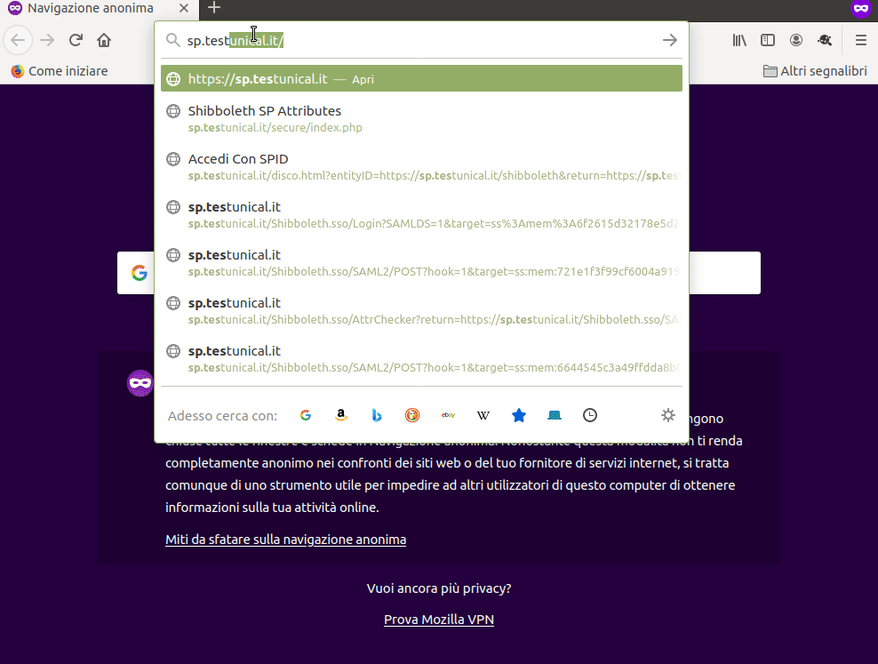

# spid-sp-shibboleth
Middleware SPID basato su Shibboleth

⚠️ Attenzione! Questo progetto si propone come un esempio di base che oggi richiede ulteriori integrazioni e adeguamenti. Apri nuove issue e raggiungici sul [canale Slack](https://developersitalia.slack.com/archives/C73R3UQE8) per contribuire.

Questo progetto contiene un setup dimostrativo composto dai seguenti:

- Shibboleth SP
- [Discovery service](https://docs.oasis-open.org/security/saml/Post2.0/sstc-saml-idp-discovery.pdf) sotto forma di pagina statica HTML
- Script per la creazione guidata dei metadata firmati
- Progetto PHP di esempio
- Configurazione di Apache2 con mod_shib

Per la installazione e la configurazione di Apache2 consigliamo di fare
riferimento ad uno degli HowTo resi disponibili dalla comunità Idem GARR.
Il tutorial IDEM GARR può essere considerato come utile fino alla sezione
_Configure Shibboleth SP_:

 - [HOWTO Install and Configure a Service Provider](https://github.com/ConsortiumGARR/idem-tutorials#howto-install-and-configure-a-service-provider)

Per la configurazione di Shibboleth SP per SPID si dovranno invece compiere i seguenti passaggi:

- creare e firmare il metadata del servizio, in [shibboleth/metadata](shibboleth/metadata) sono
  presenti due script per la creazione del metadata, uno in ruby e un altro in python.
  Questi sono da intendersi solo come esempio, per la creazione e la firma dei metadata SPID esistono altre risorse
  già disponibili su github italia.

- usare come esempio la configurazione
  [shibboleth2.xml](shibboleth/shibboleth2.xml), sostituendo i
  recapiti email, i nomi dei file del certificato e della chiave privata, l'hostname
  del SP ({sp_fqdn} diventerà ad esempio sp.example.org)

- E' necessario infine, ai fini della demo, abilitare PHP all'interno di Apache2 il virtualhost
  relativo a {sp_fqdn}, vedi il contenuto di [Apache2](Apache2/) e di [php-example-project](php-example-project/)

- copiare il metadata all'interno di un path pubblico della risorsa www del tuo {sp_fqdn}

I seguenti passaggi sono inoltre utili per svolgere una demo di test:

1. eseguire [spid-saml-check](https://github.com/italia/spid-saml-check) tramite Docker
2. scaricare i metadata di spid-saml-check nella directory `/etc/shibboleth/metadata/spid-saml-check.xml`, come definito in shibboleth2.xml

## Contribuire

## Contribuire

Aprire una issue per discutere degli scopi e delle modifiche, proporre una _Pull Request_ sul branch _dev_.
